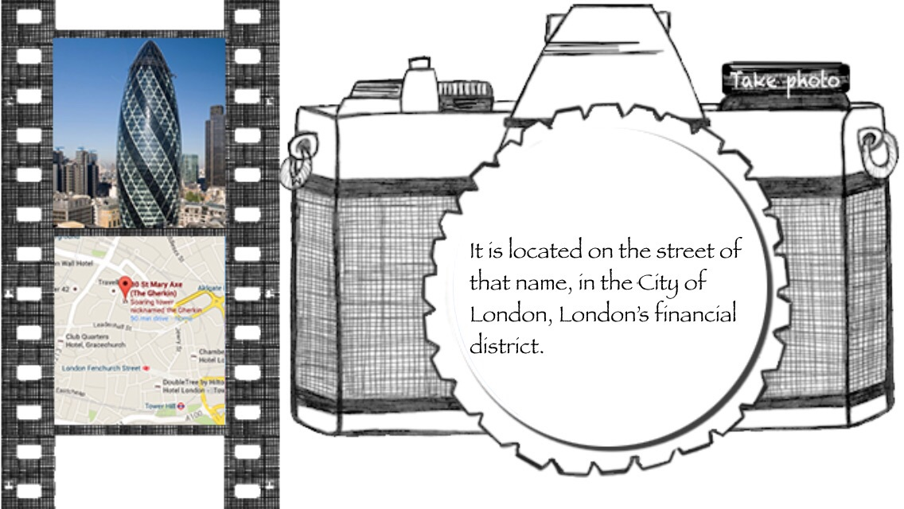
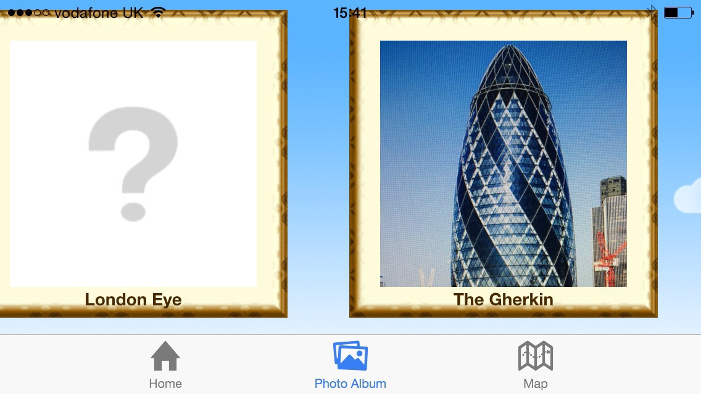
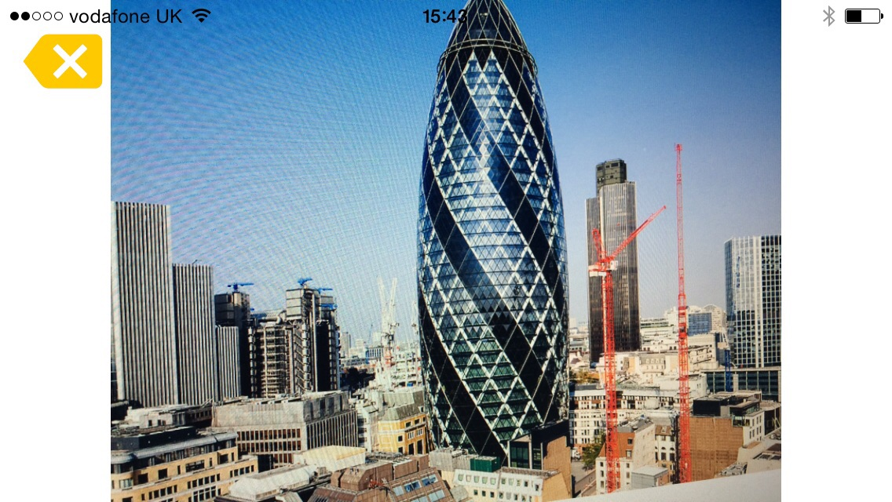
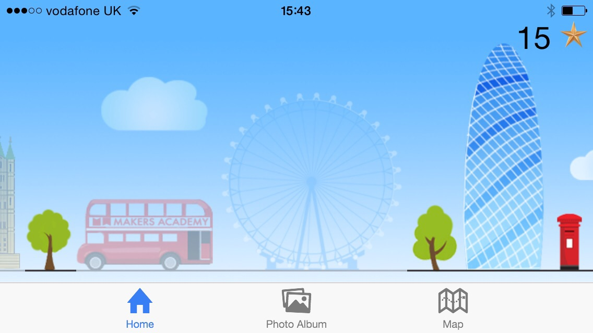

## iSpy (working title)

README still in progress.  
We recommend running this app on an iPhone in landscape mode.

#### How To Play

When opening the application, you will be met with the following screen:  

  

The translucent icons represent sights around London which you need to find to complete the game.

You can scroll sideways to see more sights.

Tapping one of the icons will load information on the sight as follows:  

In the top right of this view you can see a "Take Photo" icon on the camera. Pressing this will open your phones camera to allow you to take a picture of the sight.

Didn't work? Are you using a mobile? no? what a shame. Go get one! (its kinda ugly on android, we're still working on it).

This should take you to our gallery view. Your photo should appear in the gallery in the frame corresponding to the sight you chose to take a photo of. Scroll horizontally to find it, it should look like this:  

  

There it is! Give it a click too!

This will open up a fullscreen version of your photo, so you can take a closer look.  

  

Oh wow, you are professional!

Feel free to try out the nav bar at the bottom whenever you feel like it

You may notice that the main view has updated!  

  

The gallery is still the same, but theres one more link we have checked!

(GOOGLE MAPS LINK)

(GOOGLE MAPS)

Find your place with that button in the top right and see all the nearest locations! Such wow.

Try and collect them all!!!

A project by  
[David Upsdale](https://github.com/duskyshelf)  
[Natalie Akam](https://github.com/natstar93/)  
[Natalia Antonova](https://github.com/5555482)  
[Christian Miller](https://github.com/cwgmiller)  
